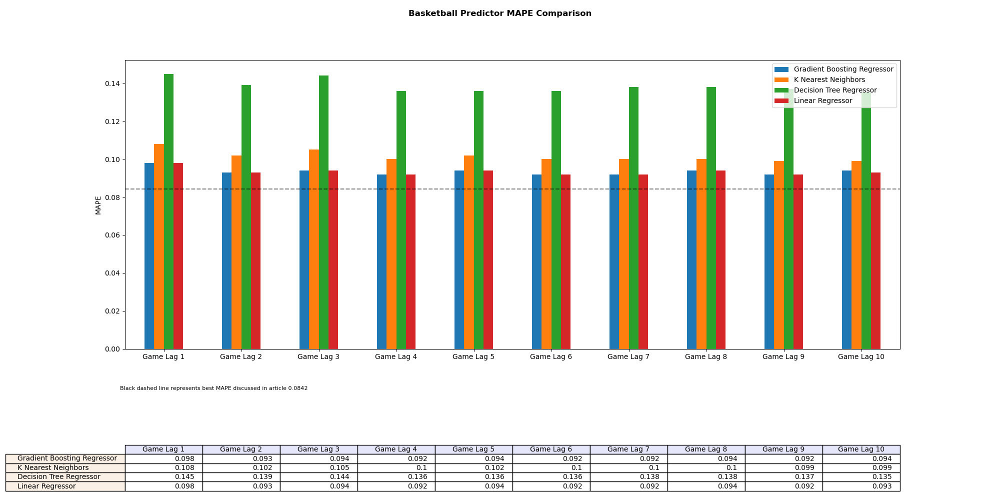

# Basketball Scores Predictor

## About




### Project

This project is an rough implementation of a published article entitled [Hybrid Basketball Game Outcome Prediction Model by Integrating Data Mining Methods for the National Basketball Association](https://www.mdpi.com/1099-4300/23/4/477).

### Data Sources

For games statistics, outcomes, etc I am using this [NBA dataset](https://www.kaggle.com/datasets/wyattowalsh/basketball) of over 64,000 NBA games.

## Running

### Python and Dependencies

This project is using `Python 3.8.0`.

You can install all the required dependencies using the `env.yaml` file `conda env create --name  basketball-scores-predictor --file env.yaml`. Alternatively I have included `requirements.txt`.

### Project

Start by downloading the [NBA dataset](https://www.kaggle.com/datasets/wyattowalsh/basketball). Extract and place `basketball.sqlite` in REPO. 

Running `create_data.bash` will extract data from the sqlite database and preprocess that data for use in the models. Once complete you should have `extracted_raw_data/*.parquet` and `model_data/game_lag_*.parquet` files/folders.

With this data you can now run the model by `python train.py`. If you are using `SPLIT_METHOD='RANDOM'` you can optionally specify a integer seed value `python train.py 123`. Running the model will make a folder `output` containing several images displaying visualisations and also a json file `metrics.json` outputting a few of the hyperparameters and resulting metrics from that run.

## Experimenting

You can experiment with your own game lag values by adding them to the `lag` list inside `create_data.bash`, rebuilding the data and then by also adding the game lag to `GAME_LAG` in `train.py`.

You can try using different types of models by adding them to `SUPPORTED_MODELS` in `train.py`. Note some functions I am using may not be supported by those you are adding and could result in errors.

Inside `train.py` you have a few parameters you can try and change. Most of these should be self explanatory, for clarity however I will describe a few:
* `PREDICTORS` these are the features.
* `YEAR_FILTER` is a filter on the dataset to only use games after the given year. Using `None` will use all games.
* `TRAINING_FRAC` is the fraction of the dataset to be used for training. The remaining will be used for testing.
* `SPLIT_METHOD` is the method which you would like to split the dataset (for training/testing). `RANDOM` will split the dataset pseudo-randomly without replacement using the seed. `TIME` will split the dataset according to the time which the game took place so with a `TRAINING_FRAC=0.8` for example, the data will be organised by the date the game took place and the first 80% will be used for training and the remaining 20% used for testing.

```python
YEAR_FILTER = 2000     # Only filter games > given year, use None for no filter
GAME_LAG = sorted([1,2, 3, 4, 5, 6, 7, 8, 9, 10])
PREDICTORS = [
    'FGA',
    'FG_PCT',
    'FG3A',
    'FG3_PCT',
    'FTA',
    'FT_PCT',
    'OREB',
    'DREB',
    'AST',
    'STL',
    'BLK',
    'TOV',
    'PF',
    'LAG_WINS',
    'LAG_LOSSES'
]
TARGET = 'PTS'
TRAINING_FRAC = 0.95
SPLIT_METHOD = 'RANDOM'      # ['TIME', 'RANDOM']
SUPPORTED_MODELS = {
    'Gradient Boosting Regressor': HistGradientBoostingRegressor(),
    'K Nearest Neighbors': KNeighborsRegressor(),
    'Decision Tree Regressor': DecisionTreeRegressor(),
    'Linear Regressor': LinearRegression()
}
```
